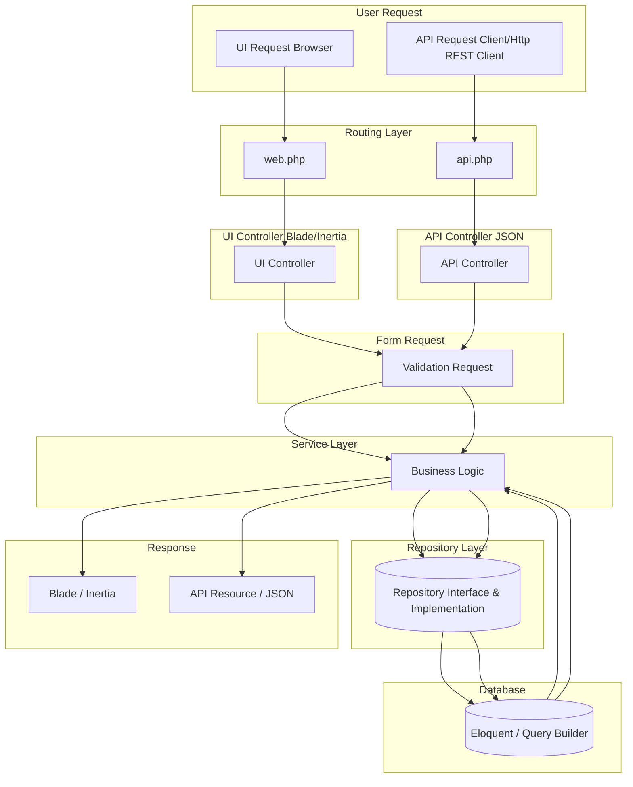

# 📘 Project Architecture Guide

## 1. Overview

This architecture or dessign pattern project is using Service-Repository Pattern with seperate controller for UI and API. The goals of this pattern is:

-   Seperate concern between UI (Blade/Inertia) and API (JSON)
-   Keep the code clean, reusable, and easy to maintain
-   Makesure seperation of concern for each layer:
    -   Controller: Just handle the request or response
    -   Request: Validation request based on schema
    -   Service: Just handle the bussines logic, e.g. calculation, if else, etc
    -   Repository: Communicate to the database using model, e.g. query
    -   Response: Return to the user is View or API Resource

## 2. Layering Pattern



## 3. Detail Flow

1. Controller (UI / API)

-   Receive request
-   Delegate validation to the request form
-   Call the service layer
-   Return response (UI: view / API: JSON)

2. Validation Request

-   File request dedicated file for schema validation
-   Makesure the input request valid before forward to the Service

3. Service Layer

-   Contains core of business logic
-   Call the repository for query data
-   Return the output to the controller

4. Repository Layer

-   Contains access to the model or database layer with interface and implementaion pattern
-   Registered at ServiceProvider so that it can be bind to the interface
-   Seperate logic query from business logic

5. Response

-   UI: return view blade or inertia
-   API: return JSON using `ApiResource`

## 4. Folder Structure (Simplified)

```
app/
 ├── Http/
 │   ├── Controllers/
 │   │   ├── Api/
 │   │   │   └── Product/ProductController.php
 │   │   └── Ui/
 │   │       └── Product/ProductController.php
 │   ├── Requests/
 │   │   └── Product/StoreProductRequest.php
 │   │   └── Product/UpdateProductRequest.php
 │   ├── Resources/
 │   │   ├── Api/
 │   │   │   └── Product/StoreProductResource.php
 │
 ├── Services/
 │   └── Product/ProductService.php
 │
 ├── Repositories/
 │   │   ├── Product/
 │   │   │   └── Interfaces/ProductRepositoryInterface.php
 │   │   │   └── ProductRepository.php
 │
 └── Providers/
     └── AppServiceRepository.php # Bind RepositoryServiceProvider (Interface)
```
