# Entity Relationship Diagram

## Whimsical


## Mermaid ERD Formatting

```
data_type column_name PK/FK-(optional) "optional comment"
```

## Mermaid

```mermaid
erDiagram
    USERS {
        bigint_unsigned id PK "User ID"
        varchar(255) name "User Name"
        varchar(255) avatar "User Avatar URL"
        varchar(255) email "User Email"
        timestamp email_verified_at
        varchar(255) password
        varchar(100) remember_token
        timestamp created_at "User Created At"
        timestamp updated_at "User Updated At"
    }

    PROFILES {
        bigint_unsigned id PK "User Profile ID"
        enum theme "ENUM['light', 'dark', 'system']"
        enum gender "ENUM['male', 'female', 'prefer_not_to_say']"
        bigint_unsigned user_id FK
        timestamp created_at "User Profile Created At"
        timestamp updated_at "User Profile Updated At"
    }

    ROLES {
        bigint_unsigned id PK "Role ID"
        varchar(255) name "Role Name"
        varchar(255) guard_name "Role Guard Name"
        timestamp created_at "Role Created At"
        timestamp updated_at "Role Updated At"
    }

    PERMISSIONS {
        bigint_unsigned id PK "Permission ID"
        varchar(255) name "Permission Name"
        timestamp created_at "Permission Created At"
        timestamp updated_at "Permission Updated At"
    }

    MODEL_HAS_ROLES {
        bigint_unsigned role_id FK "Role ID"
        varchar(255) model_type "Model Namespace"
        bigint_unsigned model_id FK "Model ID"
    }

    ROLE_HAS_PERMISSIONS {
        bigint_unsigned permission_id FK "Permission ID"
        bigint_unsigned role_id FK "Role ID"
    }

    MODEL_HAS_PERMISSIONS {
        bigint_unsigned permission_id FK "Permission ID"
        varchar(255) model_type "Model Namespace"
        bigint_unsigned model_id FK "Model ID"
    }

    ADDRESES {
        bigint_unsigned id PK "User Address ID"
        varchar(255) label_name "User Address Label"
        varchar(255) recipient_name "User Address Receipient"
        varchar(13) phone_number "User Address Phone Number"
        bigint_unsigned province_id FK "User Address Province"
        bigint_unsigned city_id FK "User Address City"
        text address "User Address"
        text note_for_courier "User Address Note"
        boolean is_default "User Address Default"
        bigint_unsigned user_id FK
        timestamp created_at "User Address Created At"
        timestamp updated_at "User Address Updated At"
    }

    CITIES {
        bigint_unsigned id PK "City Address ID"
        varchar(255) name "City Name"
        varchar(255) type "City Type"
        varchar(255) postal_code "City Postal Code"
        bigint_unsigned province_id FK "Province City"
        timestamp created_at "City Created At"
        timestamp updated_at "City Updated At"
    }

    PROVINCIES {
        bigint_unsigned id PK "Province Address ID"
        varchar(255) name "Province Name"
        timestamp created_at "Province Created At"
        timestamp updated_at "Province Updated At"
    }

    CARTS {
        bigint_unsigned id PK "Cart ID"
        bigint_unsigned user_id FK "User ID"
        timestamp created_at "Cart Created At"
        timestamp updated_at "Cart Updated At"
    }

    CART_ITEMS {
        bigint_unsigned id PK "Cart Item ID"
        integer quantity "Cart Item Qty"
        bigint_unsigned cart_id FK "Cart ID"
        bigint_unsigned product_id FK "Product ID"
        timestamp created_at "Cart Item Created At"
        timestamp updated_at "Cart Item Updated At"
    }

    WISHLISTS {
        bigint_unsigned id PK "Wishlist ID"
        varchar(255) name "Wishlist Name"
        bigint_unsigned user_id FK "User ID"
        timestamp created_at "Wishlist Created At"
        timestamp updated_at "Wishlist Updated At"
    }

    WISHLIST_ITEMS {
        bigint_unsigned id PK "Wishlist Item ID"
        bigint_unsigned wishlist_id FK "Wishlist ID"
        bigint_unsigned product_id FK "Product ID"
        timestamp created_at "Wishlist Item Created At"
        timestamp updated_at "Wishlist Item Updated At"
    }

    PRODUCTS {
        bigint_unsigned id PK "Product ID"
        varchar(255) name "Product Name"
        varchar(255) slug "Product Slug"
        text description "Product Description"
        decimal price "Product Price decimal(10,2)"
        integer stock "Product Stock"
        integer total_sold "Product Total Sold"
        boolean is_published "Product Published"
        timestamp created_at "Product Created At"
        timestamp updated_at "Product Updated At"
    }

    PRODUCT_IMAGES {
        bigint_unsigned id PK "Product Image ID"
        varchar(255) image "Product Image URL"
        bigint_unsigned product_id FK "Product ID"
        timestamp created_at "Product Image Created At"
        timestamp updated_at "Product Image Updated At"
    }

    CATEGORIES {
        bigint_unsigned id PK "Category ID"
        varchar(255) name "Category Name"
        varchar(255) slug "Category Slug"
        timestamp created_at "Category Created At"
        timestamp updated_at "Category Updated At"
    }

    CATEGORY_HAS_PRODUCTS {
        bigint_unsigned product_id FK "Product ID"
        bigint_unsigned category_id FK "Category ID"
    }

    BANNER {
        bigint_unsigned id PK "Banner ID"
        varchar(255) image "Banner Image URL"
        boolean is_active "Banner Active"
        varchar(255) target_url "Banner Redirect URL"
        timestamp created_at "Banner Created At"
        timestamp updated_at "Banner Updated At"
    }

    COURIERS {
        bigint_unsigned id PK "Courier ID"
        varchar(255) code "Courier Code Name"
        timestamp created_at "Courier Created At"
        timestamp updated_at "Courier Updated At"
    }

    ORDERS {
        bigint_unsigned id PK "Order ID"
        decimal total_price "Order Total Price decimal(10,2)"
        enum payment_status "ENUM['pending', 'paid', 'failed', 'waiting']"
        varchar(255) payment_url "Payment Redirect URL"
        varchar(255) payment_booking_code "Payment Booking Code"
        bigint_unsigned user_id FK "User ID"
        bigint_unsigned courier_id FK "Courier ID"
        timestamp created_at "Order Created At"
        timestamp updated_at "Order Updated At"
    }

    ORDER_ITEMS {
        bigint_unsigned id PK "Order Item ID"
        bigint_unsigned order_id FK "Order ID"
        bigint_unsigned product_id FK "Product ID"
        integer quantity "Order Item Qty"
        decimal price "Order Item Price decimal(10,2)"
        timestamp created_at "Order Item Created At"
        timestamp updated_at "Order Item Updated At"
    }

    REVIEWS {
        bigint_unsigned id PK "Review ID"
        enum star "ENUM[1, 2, 3, 4, 5]"
        text message "Review Message"
        boolean is_published "Review Published"
        bigint_unsigned order_item_id FK "Order Item ID"
        bigint_unsigned product_id FK "Product ID, this can be query from order_item"
        bigint_unsigned user_id FK "User ID, this can be query from order"
        timestamp created_at "Review Created At"
        timestamp updated_at "Review Updated At"
    }

    COUPON_HAS_PRODUCTS {
        bigint_unsigned product_id FK "Product ID"
        bigint_unsigned coupon_id FK "Coupon ID"
        timestamp created_at "Coupon Has Product Created At"
        timestamp updated_at "Coupon Has Product Updated At"
    }

    COUPONS {
        bigint_unsigned id PK "Coupon ID"
        varchar(255) code "Coupon Code"
        decimal discount "Coupon Discount decimal(5,2)"
        integer stock "Coupon Stock"
        timestamp expired_at "Coupon Expired"
        boolean is_active "Coupon Active"
        timestamp created_at "Coupon Created At"
        timestamp updated_at "Coupon Updated At"
    }

    USERS ||--|| PROFILES : "has one"
    USERS ||--o{ ADDRESES : "has many"
    CITIES ||--o{ ADDRESES : "has many"
    PROVINCIES ||--o{ ADDRESES : "has many"
    PROVINCIES ||--o{ CITIES : "has many"

    USERS ||--o{ MODEL_HAS_ROLES : "has many"
    ROLES ||--o{ MODEL_HAS_ROLES : "has many"

    ROLES ||--o{ ROLE_HAS_PERMISSIONS : "has many"
    PERMISSIONS ||--o{ ROLE_HAS_PERMISSIONS : "has many"

    PERMISSIONS ||--o{ MODEL_HAS_PERMISSIONS : "has many"
    USERS ||--o{ MODEL_HAS_PERMISSIONS : "has many"

    USERS ||--|| CARTS : "has one"
    CARTS ||--o{ CART_ITEMS : "has many"
    PRODUCTS ||--o{ CART_ITEMS : "has many"

    USERS ||--o{ WISHLISTS : "has many"
    WISHLISTS ||--o{ WISHLIST_ITEMS : "has many"
    PRODUCTS ||--o{ WISHLIST_ITEMS : "has many"

    PRODUCTS ||--o{ PRODUCT_IMAGES : "has many"
    PRODUCTS ||--o{ CATEGORY_HAS_PRODUCTS : "has many"
    CATEGORIES ||--o{ CATEGORY_HAS_PRODUCTS : "has many"

    USERS ||--o{ ORDERS : "has many"
    COURIERS ||--o{ ORDERS : "has many"
    COUPONS ||--o{ ORDERS : "has many"

    ORDERS ||--o{ ORDER_ITEMS : "has many"
    PRODUCTS ||--o{ ORDER_ITEMS : "has many"

    ORDER_ITEMS ||--|| REVIEWS : "has one"
    PRODUCTS ||--o{ REVIEWS : "has many"
    USERS ||--o{ REVIEWS : "has many"

    COUPONS ||--o{ COUPON_HAS_PRODUCTS : "has many"
    PRODUCTS ||--o{ COUPON_HAS_PRODUCTS : "has many"
```



## List Relationship

```c
1. Users <> Profiles (One to One/HasOne <> BelongsTo)
2. Users <> Addresses (One to Many/HasMany <> BelongsTo)
3. Cities <> Addresses (One to Many/HasMany <> BelongsTo)
4. Provinces <> Addresses (One to Many/HasMany <> BelongsTo)
5. Users <> Model Has Roles (One to Many/HasMany <> BelongsTo)
6. Roles <> Model Has Roles (One to Many/HasMany <> BelongsTo)
7. Roles <> Role Has Permissions (One to Many/HasMany <> BelongsTo)
8. Permission <> Role Has Permissions (One to Many/HasMany <> BelongsTo)
9. Permission <> Model Has Permissions (One to Many/HasMany <> BelongsTo)
10. Users <> Model Has Permissions (One to Many/HasMany <> BelongsTo)
11. Users <> Carts (One to One/HasOne <> BelongsTo)
12. Carts <> Cart Items (One to Many/HasMany <> BelongsTo)
13. Products <> Cart Items (One to Many/HasMany <> BelongsTo)
14. Users <> Wishlists (One to Many/HasMany <> BelongsTo)
15. Wishlists <> Wishlist Items (One to Many/HasMany <> BelongsTo)
16. Products <> Wishlist Items (One to Many/HasMany <> BelongsTo)
17. Products <> Product Images (One to Many/HasMany <> BelongsTo)
18. Products <> Category Has Products (One to Many/HasMany <> BelongsTo)
19. Categories <> Category Has Products (One to Many/HasMany <> BelongsTo)
20. Users <> Orders (One to Many/HasMany <> BelongsTo)
21. Couriers <> Orders (One to Many/HasMany <> BelongsTo)
22. Orders <> Order Items (One to Many/HasMany <> BelongsTo)
23. Products <> Order Items (One to Many/HasMany <> BelongsTo)
24. Order Items <> Reviews (One to One/HasOne <> BelongsTo)
25. Products <> Reviews (One to Many/HasMany <> BelongsTo)
26. Users <> Reviews (One to Many/HasMany <> BelongsTo)
27. Coupons <> Coupon Has Products (One to Many/HasMany <> BelongsTo)
28. Products <> Coupon Has Products (One to Many/HasMany <> BelongsTo)
29. Provinces <> Cities (One to Many/HasMany <> BelongsTo)
30. Coupons <> Orders (One to Many/HasMany <> BelongsTo)
```
